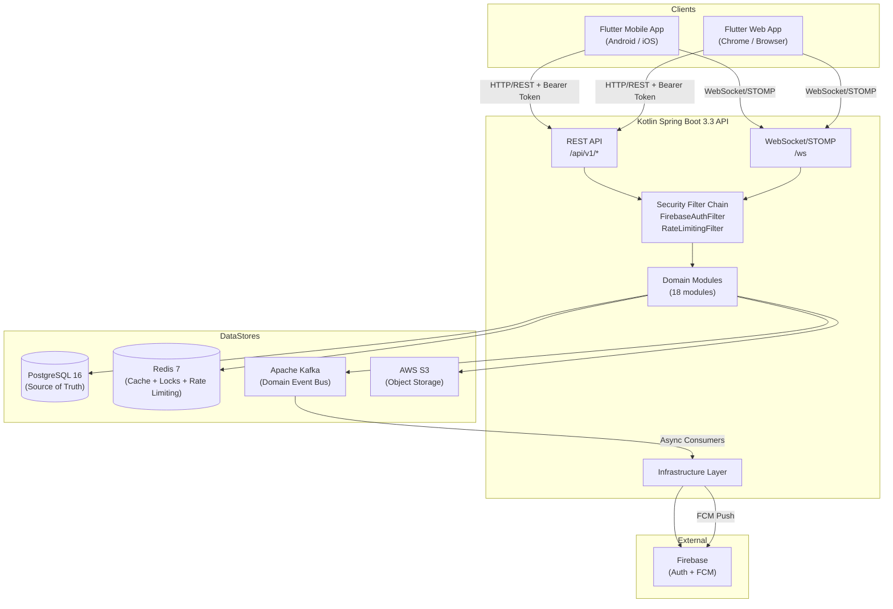
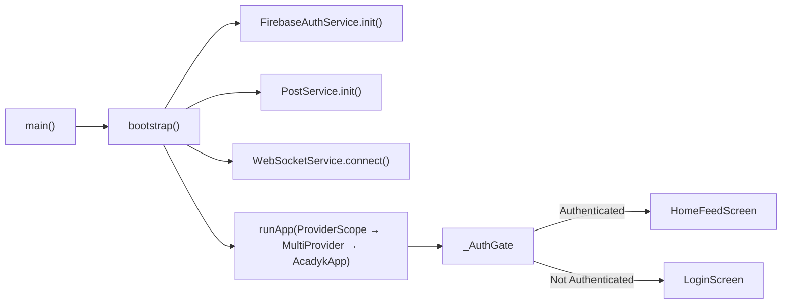
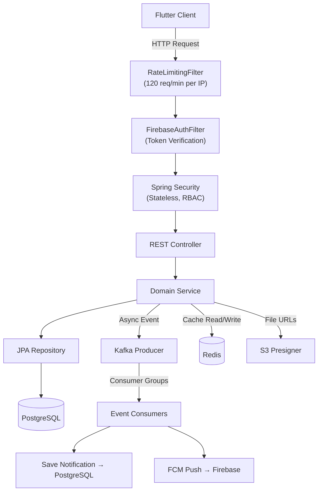
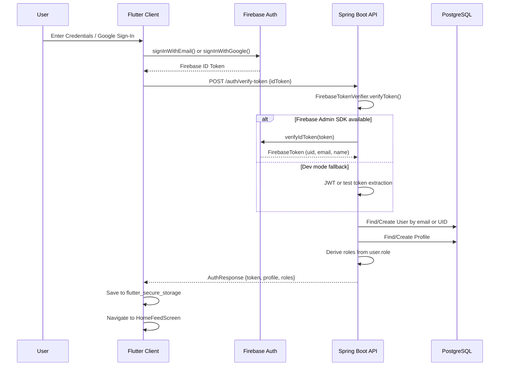
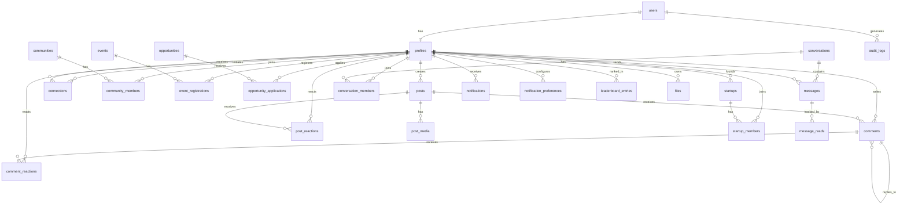
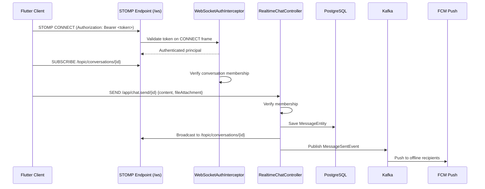

# Acadyk — Current Architecture Document

> **Source of truth**: This document describes the architecture as implemented in the repository.
> Claims are traceable to specific files, modules, and configurations.
> Last verified: September 2026.

---

## 1. Overview

**Acadyk** is an academic, professional, and career discovery network built for the student community of **Madhav Institute of Technology & Science (MITS), Gwalior**. It combines LinkedIn-style professional networking with Instagram-style social feeds and WhatsApp-style real-time messaging.

### What the System Does Today

- Institutional Google OAuth and email/password authentication restricted to `@mitsgwl.ac.in` / `@mits.ac.in` domains
- Social feed with posts, media attachments, reactions, threaded comments
- Professional profiles with education, skills, projects, work experience, resumes, and achievements
- Real-time chat (direct and group) over WebSocket/STOMP with typing indicators, read receipts, and file attachments
- Communities (clubs) with membership governance
- Events with registration
- Career opportunities (internships, hackathons, research, full-time) with application tracking
- Startup showcase
- Leaderboard and gamification
- Global multi-entity search with autocomplete
- Push notifications via Firebase Cloud Messaging with user preference controls
- File upload/download via AWS S3 pre-signed URLs

### Architecture Style

Monorepo containing a **Flutter mobile/web client** and a **Kotlin Spring Boot monolithic backend**, communicating via REST and WebSocket/STOMP. Asynchronous event processing via Apache Kafka. PostgreSQL as transactional source of truth with Redis for caching/rate-limiting and AWS S3 for object storage.

---

## 2. System Architecture



---

## 3. Repository Structure

```
Acadyk/
├── apps/
│   └── mobile/                          # Flutter client (Android, iOS, Web)
│       ├── lib/
│       │   ├── app/                     # App root, bootstrap, config, router, theme
│       │   ├── common/                  # Shared models, providers, services
│       │   ├── core/                    # Auth, network (API client, WebSocket), storage
│       │   ├── features/               # 16 feature modules (feature-first architecture)
│       │   └── shared/                 # Shared widgets
│       ├── assets/                      # Images, icons, fonts, animations
│       ├── android/ ios/ web/ macos/    # Platform shells
│       └── pubspec.yaml                 # Dart/Flutter dependencies
│
├── backend/
│   └── acadyk-api/                      # Kotlin Spring Boot 3.3 API
│       ├── src/main/kotlin/com/acadyk/
│       │   ├── AcadykApplication.kt     # Entry point (@EnableAsync, @EnableScheduling)
│       │   ├── common/                  # ApiResponse, exceptions, BaseEntity
│       │   ├── config/                  # SecurityConfig, RedisConfig, AwsS3Config, WebConfig
│       │   ├── security/               # FirebaseAuthFilter, TokenVerifier, RateLimiting, RBAC
│       │   ├── infrastructure/          # FCM, Kafka, Redis, S3, WebSocket, Observability
│       │   └── modules/                 # 18 domain modules
│       ├── src/main/resources/          # application.yml, profile configs, Flyway migrations
│       ├── build.gradle.kts             # Gradle build with all dependencies
│       └── Dockerfile                   # Multi-stage JDK 21 container
│
├── database/
│   └── migrations/                      # 15 Flyway SQL migrations (V1–V20)
│
├── infrastructure/
│   ├── aws/                             # S3 CORS and bucket policies
│   ├── docker/                          # Nginx reverse proxy config
│   └── monitoring/                      # Prometheus scrape config
│
├── scripts/                             # Bootstrap, lint, test, release shell scripts
├── .github/workflows/                   # 13 CI/CD workflow definitions
├── docker-compose.yml                   # Local dev stack (Postgres, Redis, Kafka, API)
├── docker-compose.prod.yml              # Production API container
├── docker-compose.staging.yml           # Staging environment
├── Makefile                             # Monorepo task automation
└── .env.example                         # Environment variable definitions
```

---

## 4. Frontend Architecture

**Framework**: Flutter 3.x (Dart SDK ≥3.0.0)
**Platforms**: Android, iOS, Web, macOS (shell present)
**Entry point**: `apps/mobile/lib/main.dart` → `bootstrap()`

### State Management

Dual state management:
- **Riverpod** (`flutter_riverpod ^2.5.1`) — used for newer feature-level async state via `ProviderScope`
- **Provider** (`provider ^6.1.2`) — legacy `ChangeNotifierProvider` for `AuthProvider`, `ProfileProvider`, `ThemeProvider`

Both are initialized in `bootstrap.dart` with `ProviderScope` wrapping `MultiProvider`.

Evidence: [`bootstrap.dart`](file:///c:/Users/HP/Acadyk/apps/mobile/lib/app/bootstrap.dart)

### Feature Modules (16)

| Feature | Directory | Responsibility |
|---|---|---|
| auth | `features/auth/` | Login, registration, password reset screens |
| feed | `features/feed/` | Home feed, post creation, event details, registration |
| profile | `features/profile/` | 40+ screens (profile, settings, edit, resume, projects, etc.) |
| chat | `features/chat/` | Direct and group messaging |
| comments | `features/comments/` | Threaded comment system |
| connections | `features/connections/` | Professional networking |
| community | `features/community/` | Clubs and community management |
| events | `features/events/` | Campus events |
| opportunities | `features/opportunities/` | Career opportunities |
| startups | `features/startups/` | Startup showcase |
| search | `features/search/` | Global search delegate |
| notifications | `features/notifications/` | Notification feed, club join review |
| leaderboard | `features/leaderboard/` | Gamification rankings |
| file_viewer | `features/file_viewer/` | In-app PDF/document viewer |
| settings | `features/settings/` | App settings |
| clubs | `features/clubs/` | Club management |

### Networking

- **HTTP**: Dio 5.7 via `ApiClient` singleton with interceptor chain for automatic Bearer token injection and 401 retry with force-refreshed Firebase ID token.
  Evidence: [`api_client.dart`](file:///c:/Users/HP/Acadyk/apps/mobile/lib/core/network/api_client.dart)

- **WebSocket**: Raw STOMP-over-WebSocket implementation using `web_socket_channel`. Features topic subscriptions, offline message queue, heartbeat (15s), and exponential backoff reconnection (max 3 attempts).
  Evidence: [`websocket_service.dart`](file:///c:/Users/HP/Acadyk/apps/mobile/lib/core/network/websocket_service.dart)

### Environment Configuration

Environment-aware config supporting `development`, `staging`, and `production` via `--dart-define=APP_ENV=<env>`. API and WebSocket URLs are independently overridable at compile time.

- Development: `http://35.154.243.7:8080/api/v1` (AWS EC2)
- Staging: `https://staging.acadyk.com/api/v1`
- Production: `http://35.154.243.7:8080/api/v1`

Evidence: [`app_config.dart`](file:///c:/Users/HP/Acadyk/apps/mobile/lib/app/config/app_config.dart)

### Local Storage

- `flutter_secure_storage` for auth tokens, user profiles, and session timestamps
- 15-day session duration with automatic expiry

### Frontend Flow



---

## 5. Backend Architecture

**Framework**: Spring Boot 3.3.2 (Kotlin 1.9.24, JDK 21)
**Entry point**: `AcadykApplication.kt` — `@SpringBootApplication`, `@EnableAsync`, `@EnableScheduling`
**API prefix**: `/api/v1/`
**WebSocket endpoint**: `/ws`

### Module Structure (18 Domain Modules)

Each module follows a consistent internal structure: `controller/ → dto/ → entity/ → mapper/ → repository/ → service/`

| Module | Controller | Purpose |
|---|---|---|
| auth | `AuthController` | Token verification, login, register, session, password reset, account deletion |
| users | — (internal) | User entity and repository (no public controller) |
| profiles | `ProfileController` | CRUD profiles, search, photo management |
| posts | `PostController` | Feed posts CRUD, media |
| comments | (within posts) | Threaded comments on posts |
| reactions | `ReactionController` | Like/unlike posts and comments |
| connections | `ConnectionController` | Send/accept/reject connection requests |
| communities | `CommunityController` | Club/community CRUD, membership |
| clubs | (within communities) | Club sub-entities |
| events | `EventController` | Event CRUD, registration |
| opportunities | `OpportunityController` | Career opportunity CRUD, applications |
| startups | `StartupController` | Startup showcase CRUD |
| chat | (WebSocket) | Conversations, messages (REST + STOMP) |
| notifications | `NotificationController` | Notification feed, preferences, FCM registration |
| leaderboard | `LeaderboardController` | Gamification rankings |
| files | `FileController` | File upload/download via S3 pre-signed URLs |
| search | `SearchController` | Global multi-entity search, autocomplete |
| admin | `AdminController` | Administrative operations |

### Infrastructure Services

| Service | File | Purpose |
|---|---|---|
| `S3StorageService` | `infrastructure/s3/` | Direct upload, pre-signed PUT/GET URLs for client-to-S3 transfers |
| `FcmService` | `infrastructure/fcm/` | FCM push notification dispatch with per-user device token registry |
| `DomainEventPublisher` | `infrastructure/kafka/` | Typed Kafka producer publishing to 12 topic channels |
| `RealtimeChatEventConsumer` | `infrastructure/kafka/` | High-priority consumer for `acadyk.chat` → FCM push for offline users |
| `FeedFanoutEventConsumer` | `infrastructure/kafka/` | Async consumer for posts, reactions, comments, follows → notifications + cache invalidation |
| `SocialNotificationEventConsumer` | `infrastructure/kafka/` | Async consumer for connections, opportunities, applications |
| `RedisDistributedLock` | `infrastructure/redis/` | Atomic SET-NX locks with Lua script release |
| `RedisRateLimiter` | `infrastructure/redis/` | Sliding window rate limiting |
| `RedisCacheService` | `infrastructure/redis/` | Cache-aside pattern with TTL, pattern eviction |
| `WebSocketConfig` | `infrastructure/websocket/` | STOMP broker config, auth interceptor, real-time chat controller |
| `MdcLoggingFilter` | `infrastructure/observability/` | Request correlation ID injection |
| `SentryService` | `infrastructure/observability/` | Error tracking integration |

### Backend Flow



---

## 6. API Architecture

All endpoints are versioned under `/api/v1/`. Responses follow a standard envelope:

```json
{
  "success": true,
  "message": "...",
  "data": { ... },
  "timestamp": "2026-09-09T..."
}
```

### Auth Endpoints (`/api/v1/auth/*`)

| Method | Path | Auth | Purpose |
|---|---|---|---|
| POST | `/auth/verify-token` | Public | Verify Firebase ID token, auto-provision user, return profile + roles |
| POST | `/auth/login` | Public | Email/password login for pre-provisioned accounts |
| POST | `/auth/register` | Public | Registration (requires pre-provisioned institutional account) |
| POST | `/auth/reset-password` | Public | Password reset request |
| GET | `/auth/session` | Bearer | Get current session profile |
| DELETE | `/auth/delete-account` | Bearer | Soft-delete user account |

### Core Resource Endpoints

| Group | Base Path | Methods | Auth |
|---|---|---|---|
| Profiles | `/api/v1/profiles` | GET, PUT, PATCH | Bearer |
| Posts | `/api/v1/posts` | GET (public), POST, PUT, DELETE | GET=Public, others=Bearer |
| Reactions | `/api/v1/reactions` | POST, DELETE | Bearer |
| Comments | `/api/v1/comments` | GET, POST, PUT, DELETE | Bearer |
| Connections | `/api/v1/connections` | GET, POST, PUT, DELETE | Bearer |
| Communities | `/api/v1/communities` | GET, POST, PUT, DELETE | Bearer |
| Events | `/api/v1/events` | GET, POST, PUT, DELETE | Bearer |
| Opportunities | `/api/v1/opportunities` | GET, POST, PUT, DELETE | Bearer |
| Startups | `/api/v1/startups` | GET, POST, PUT, DELETE | Bearer |
| Chat | `/api/v1/chat` | GET, POST | Bearer |
| Notifications | `/api/v1/notifications` | GET, PUT | Bearer |
| Leaderboard | `/api/v1/leaderboard` | GET | Bearer |
| Files | `/api/v1/files` | GET, POST | Bearer |
| Search | `/api/v1/search` | GET | Bearer |
| Search Autocomplete | `/api/v1/search/autocomplete` | GET | Bearer |

### WebSocket Endpoints

| Destination | Direction | Purpose |
|---|---|---|
| `/ws` | Client → Server | STOMP connection endpoint (+ SockJS fallback) |
| `/app/chat.send/{conversationId}` | Client → Server | Send chat message |
| `/app/chat.typing/{conversationId}` | Client → Server | Typing indicator (fire-and-forget) |
| `/app/chat.delivered/{conversationId}` | Client → Server | Delivery/read receipt |
| `/topic/conversations/{id}` | Server → Client | Real-time message broadcast |
| `/topic/conversations/{id}/typing` | Server → Client | Typing indicator broadcast |
| `/topic/conversations/{id}/receipts` | Server → Client | Receipt broadcast |

---

## 7. Authentication & Authorization

### Authentication Flow



### Domain Restriction

Google Sign-In is restricted to `@mitsgwl.ac.in` and `@mits.ac.in` domains. Non-institutional emails are rejected at both client and server.

Evidence: [`FirebaseAuthService.signInWithGoogle()`](file:///c:/Users/HP/Acadyk/apps/mobile/lib/core/auth/firebase_auth_service.dart#L177-L273) and [`AuthService.verifyFirebaseToken()`](file:///c:/Users/HP/Acadyk/backend/acadyk-api/src/main/kotlin/com/acadyk/modules/auth/AuthModule.kt#L60-L218)

### Token Verification Pipeline (Backend)

The `FirebaseTokenVerifier` follows a 3-tier verification strategy:

1. **Firebase Admin SDK** — Production path. Cryptographic verification of ID tokens.
2. **HMAC JWT** — Internal service-to-service tokens signed with `jwt.secret`.
3. **Dev mock tokens** — Only when `acadyk.auth.dev-mode-enabled=true`. Accepts `test-token-*`, `session_*`, and raw JWT payload extraction.

Evidence: [`FirebaseTokenVerifier.kt`](file:///c:/Users/HP/Acadyk/backend/acadyk-api/src/main/kotlin/com/acadyk/security/FirebaseTokenVerifier.kt)

### Role-Based Access Control (RBAC)

| Role | Description |
|---|---|
| `STUDENT` | Default role for all institutional accounts |
| `FACULTY` | Faculty members |
| `COLLEGE_ADMIN` | College administration |
| `COMPANY` | Corporate/recruiter accounts |
| `MODERATOR` | Content moderation |
| `SUPER_ADMIN` | Full system access (inherits COLLEGE_ADMIN) |

Roles are stored in PostgreSQL `users.role` and enforced via `@PreAuthorize` / `@Secured` annotations (method-level security enabled).

Evidence: [`Role.kt`](file:///c:/Users/HP/Acadyk/backend/acadyk-api/src/main/kotlin/com/acadyk/security/Role.kt), [`SecurityConfig.kt`](file:///c:/Users/HP/Acadyk/backend/acadyk-api/src/main/kotlin/com/acadyk/config/SecurityConfig.kt)

### Session Management

- Backend is fully **stateless** (`SessionCreationPolicy.STATELESS`)
- Client stores Firebase ID token in `flutter_secure_storage`
- 15-day client-side session duration with automatic expiry
- 401 responses trigger automatic token force-refresh and retry

---

## 8. Database Architecture

**Database**: PostgreSQL 16 (Alpine)
**Schema management**: Flyway (15 ordered SQL migrations, V1–V20)
**JPA**: Hibernate with `ddl-auto: none` (schema fully migration-driven)
**Connection pool**: HikariCP (20 max, 5 min idle for dev; 30/10 for prod)

### Entity-Relationship Diagram



### Migration Summary

| Migration | Tables |
|---|---|
| V1 | PostgreSQL extensions (`uuid-ossp`, `pgcrypto`, `citext`) and enum types |
| V2 | `users`, `profiles` |
| V3 | `profile_details` (education, skills, projects, experience, resumes) |
| V4 | `posts`, `post_media`, `comments`, `post_reactions`, `comment_reactions` |
| V5 | `connections` |
| V6 | `communities`, `community_members` |
| V7 | `events`, `event_registrations` |
| V8 | `startups`, `startup_members`, `startup_media` |
| V9 | `conversations`, `conversation_members`, `messages`, `message_reads` |
| V10 | `notifications`, `notification_preferences` |
| V11 | `leaderboard_entries`, `files` |
| V12 | `audit_logs` |
| V13 | Performance indexes (`pg_trgm`, composite, partial) |
| V19 | Chat file attachment columns on `messages` |
| V20 | Seed data for rich UI feed posts |

Evidence: [`database/migrations/`](file:///c:/Users/HP/Acadyk/database/migrations)

---

## 9. Event-Driven Architecture (Kafka)

### Kafka Topic Map

| Topic | Publisher | Consumer Group | Consumer | Priority |
|---|---|---|---|---|
| `acadyk.chat` | `DomainEventPublisher` | `acadyk-realtime-chat` | `RealtimeChatEventConsumer` | **High** (real-time) |
| `acadyk.posts` | `DomainEventPublisher` | `acadyk-feed-fanout` | `FeedFanoutEventConsumer` | Normal |
| `acadyk.reactions` | `DomainEventPublisher` | `acadyk-feed-fanout` | `FeedFanoutEventConsumer` | Normal |
| `acadyk.comments` | `DomainEventPublisher` | `acadyk-feed-fanout` | `FeedFanoutEventConsumer` | Normal |
| `acadyk.follows` | `DomainEventPublisher` | `acadyk-feed-fanout` | `FeedFanoutEventConsumer` | Normal |
| `acadyk.connections` | `DomainEventPublisher` | `acadyk-social-notifications` | `SocialNotificationEventConsumer` | Normal |
| `acadyk.opportunities` | `DomainEventPublisher` | `acadyk-social-notifications` | `SocialNotificationEventConsumer` | Normal |
| `acadyk.applications` | `DomainEventPublisher` | `acadyk-social-notifications` | `SocialNotificationEventConsumer` | Normal |
| `acadyk.users` | `DomainEventPublisher` | — | — | Declared, no active consumer |
| `acadyk.profiles` | `DomainEventPublisher` | — | — | Declared, no active consumer |
| `acadyk.events` | `DomainEventPublisher` | — | — | Declared, no active consumer |
| `acadyk.notifications` | `DomainEventPublisher` | — | — | Declared, no active consumer |

### Consumer Architecture

The codebase splits consumers by latency requirements (described in source comments as "channels"):

- **WhatsApp Channel** (real-time): `RealtimeChatEventConsumer` — instant FCM push for offline users
- **Twitter Channel** (async fan-out): `FeedFanoutEventConsumer` — cache invalidation, notification creation
- **Social Channel** (async): `SocialNotificationEventConsumer` — connection and application notifications

Evidence: [`DomainEventPublisher.kt`](file:///c:/Users/HP/Acadyk/backend/acadyk-api/src/main/kotlin/com/acadyk/infrastructure/kafka/DomainEventPublisher.kt), [`RealtimeChatEventConsumer.kt`](file:///c:/Users/HP/Acadyk/backend/acadyk-api/src/main/kotlin/com/acadyk/infrastructure/kafka/RealtimeChatEventConsumer.kt), [`FeedFanoutEventConsumer.kt`](file:///c:/Users/HP/Acadyk/backend/acadyk-api/src/main/kotlin/com/acadyk/infrastructure/kafka/FeedFanoutEventConsumer.kt)

---

## 10. Real-Time Communication

### WebSocket/STOMP Architecture



### Capabilities

- Text messages with instant broadcast
- File/document messages with MIME-type detection (IMAGE, VIDEO, AUDIO, DOCUMENT)
- Typing indicators (fire-and-forget, not persisted)
- Delivery/read receipts broadcast to conversation subscribers
- Conversation membership verification on both SUBSCRIBE and SEND

Evidence: [`WebSocketInfrastructure.kt`](file:///c:/Users/HP/Acadyk/backend/acadyk-api/src/main/kotlin/com/acadyk/infrastructure/websocket/WebSocketInfrastructure.kt)

---

## 11. File & Storage Architecture

### AWS S3 Integration

- **Direct upload**: Server-side `putObject` via AWS SDK
- **Pre-signed PUT URL**: Client-to-S3 direct upload (15-minute expiry)
- **Pre-signed GET URL**: Temporary secure download links (30-minute expiry)
- **Bucket**: Configurable via `AWS_S3_BUCKET` (default: `acadyk-media-bucket`)
- **Region**: Configurable via `AWS_REGION` (default: `us-east-1`)

S3 bucket policies and CORS configuration are defined in `infrastructure/aws/`.

Evidence: [`S3StorageService.kt`](file:///c:/Users/HP/Acadyk/backend/acadyk-api/src/main/kotlin/com/acadyk/infrastructure/s3/S3StorageService.kt), [`AwsS3Config.kt`](file:///c:/Users/HP/Acadyk/backend/acadyk-api/src/main/kotlin/com/acadyk/config/AwsS3Config.kt)

### Client-Side File Handling

- `file_picker` for document selection
- `image_picker` for photo/camera capture
- `camera` for live camera service (platform-conditional: mobile, web, stub)
- `pdfrx` for in-app PDF rendering
- `open_filex` for native file open intent
- `path_provider` for WhatsApp-style persistent local storage

---

## 12. Notifications

### In-App Notifications

Persisted in PostgreSQL `notifications` table with `type`, `title`, `body`, `action_url`, `entity_type`, and `entity_id`. Created asynchronously by Kafka consumers.

### Push Notifications (FCM)

- Device tokens registered per user in `FcmService` (in-memory `ConcurrentHashMap`)
- Push dispatch respects user notification preferences (`notification_preferences` table)
- Preference checks: `pushEnabled`, `chatNotifications`, `connectionRequests`, `eventReminders`
- FCM calls are non-blocking and guaranteed not to throw (fail-safe)

Evidence: [`FcmService.kt`](file:///c:/Users/HP/Acadyk/backend/acadyk-api/src/main/kotlin/com/acadyk/infrastructure/fcm/FcmService.kt)

---

## 13. Search Architecture

Search is implemented using **PostgreSQL full-text search** with `pg_trgm` indexes. No Elasticsearch instance exists in the current deployment.

The `SearchService` performs multi-entity search across 6 entity types: profiles, posts, opportunities, events, communities, and startups. Profile search uses `pg_trgm` indexes for typo-tolerant matching. Other entities use in-memory `contains()` filtering over paginated JPA queries.

Autocomplete returns top-5 profile matches for queries ≥ 2 characters.

Evidence: [`SearchService.kt`](file:///c:/Users/HP/Acadyk/backend/acadyk-api/src/main/kotlin/com/acadyk/modules/search/service/SearchService.kt)

> **Note**: The README references Elasticsearch, but no Elasticsearch dependency, client, or configuration exists in `build.gradle.kts` or `application.yml`. Search is PostgreSQL-only.

---

## 14. Security Architecture

### Filter Chain Order

1. `RateLimitingFilter` → IP-based sliding window (120 req/min per IP)
2. `FirebaseAuthFilter` → Token extraction, verification, user resolution, principal injection

### Security Headers

Applied by `RateLimitingFilter` on every response:
- `X-Content-Type-Options: nosniff`
- `X-Frame-Options: DENY`
- `X-XSS-Protection: 1; mode=block`
- `Strict-Transport-Security: max-age=31536000; includeSubDomains`

### CORS

Configurable via `CORS_ALLOWED_ORIGINS` environment variable. Supports exact origins and wildcard patterns. Defaults to `*` in development.

### Other Security Measures

- CSRF disabled (stateless API)
- HTTP Basic and form login disabled
- Redis distributed locks for atomic operations (Lua script release to prevent lock theft)
- Audit logging for all auth events (`AuditService` → `audit_logs` table)
- Soft-delete pattern (no hard deletes)

Evidence: [`SecurityConfig.kt`](file:///c:/Users/HP/Acadyk/backend/acadyk-api/src/main/kotlin/com/acadyk/config/SecurityConfig.kt), [`RateLimitingFilter.kt`](file:///c:/Users/HP/Acadyk/backend/acadyk-api/src/main/kotlin/com/acadyk/security/RateLimitingFilter.kt)

---

## 15. External Integrations

| Integration | Purpose | Evidence |
|---|---|---|
| **Firebase Authentication** | Client-side Google OAuth and email/password auth | `firebase_auth`, `google_sign_in` in pubspec.yaml |
| **Firebase Admin SDK** | Server-side ID token verification | `firebase-admin:9.3.0` in build.gradle.kts |
| **Firebase Cloud Messaging** | Push notifications to mobile devices | `FcmService.kt` |
| **AWS S3** | Object storage for media, documents, resumes | `software.amazon.awssdk:s3` in build.gradle.kts |
| **Sentry** | Error tracking (infrastructure layer) | `SentryService.kt` (referenced, DSN env-configurable) |

### Not Currently Integrated (Despite README References)

- **Elasticsearch**: No dependency, client, or configuration present
- **Supabase**: No dependency or usage in the codebase

---

## 16. AI/ML Architecture

No implemented AI/ML architecture was identified in the current repository.

No AI model inference, preprocessing, ML framework dependencies, or AI service integrations exist in either the Flutter client or the Spring Boot backend.

---

## 17. Deployment & Infrastructure

### Local Development

```bash
# Start infrastructure
docker-compose up -d postgres redis kafka

# Run backend
cd backend/acadyk-api && ./gradlew bootRun

# Run Flutter
cd apps/mobile && flutter run
```

### Docker

- **Dev**: `docker-compose.yml` — PostgreSQL 16, Redis 7, Kafka 7.5 (KRaft mode), and the API container
- **Staging**: `docker-compose.staging.yml`
- **Production**: `docker-compose.prod.yml` — API-only container with external managed databases, resource limits (2 CPU, 2GB RAM), health checks via Actuator

### Backend Container

Multi-stage Dockerfile: `gradle:8.8-jdk21-alpine` → `eclipse-temurin:21-jre-alpine`. Produces a ~150MB container.

Evidence: [`Dockerfile`](file:///c:/Users/HP/Acadyk/backend/acadyk-api/Dockerfile)

### Reverse Proxy

Nginx configuration for `api.acadyk.com` with WebSocket upgrade support.

Evidence: [`nginx.conf`](file:///c:/Users/HP/Acadyk/infrastructure/docker/nginx.conf)

### Monitoring

Prometheus scraping Spring Boot Actuator metrics at `/actuator/prometheus`.
Actuator endpoints exposed: `health`, `info`, `metrics`, `prometheus`.

Evidence: [`prometheus.yml`](file:///c:/Users/HP/Acadyk/infrastructure/monitoring/prometheus.yml)

### CI/CD

13 GitHub Actions workflows covering:
- Flutter CI (`flutter_ci.yml`, `ci.yml`)
- Android APK builds (`android.yml`, `android_build.yml`, `build-apk.yml`)
- iOS builds (`ios.yml`, `ios_build.yml`, `build-ios.yml`)
- Staging deployment (`main_staging.yml`)
- Production release (`release_prod.yml`, `release.yml`)
- PR checks (`pull_request.yml`)
- Deploy (`deploy.yml`)

### Production Server

App config reveals `35.154.243.7` as the production backend IP (AWS EC2 in `ap-south-1` based on the IP range).

---

## 18. Environment Configuration

### Variable Names (from `.env.example`)

```
SPRING_PROFILES_ACTIVE
SERVER_PORT
SPRING_DATASOURCE_URL
SPRING_DATASOURCE_USERNAME
SPRING_DATASOURCE_PASSWORD
SPRING_DATA_REDIS_HOST
SPRING_DATA_REDIS_PORT
SPRING_KAFKA_BOOTSTRAP_SERVERS
AWS_REGION
AWS_S3_BUCKET
AWS_ACCESS_KEY_ID
AWS_SECRET_ACCESS_KEY
FIREBASE_CONFIG_PATH
```

### Additional Production Variables (from docker-compose.prod.yml)

```
PROD_DB_URL
PROD_DB_USER
PROD_DB_PASSWORD
PROD_REDIS_HOST
PROD_REDIS_PORT
PROD_REDIS_PASSWORD
PROD_KAFKA_BROKERS
PROD_S3_BUCKET
PROD_AWS_REGION
PROD_CORS_ORIGINS
PROD_SENTRY_DSN
DOCKER_REGISTRY
IMAGE_TAG
JWT_SECRET
```

> **No actual secret values are exposed in this document.**

---

## 19. Key Dependencies

### Frontend (Flutter/Dart)

| Category | Package | Version |
|---|---|---|
| HTTP | `dio` | ^5.7.0 |
| WebSocket | `web_socket_channel`, `stomp_dart_client` | ^3.0.1, ^2.1.2 |
| State | `flutter_riverpod`, `provider` | ^2.5.1, ^6.1.2 |
| Auth | `firebase_core`, `firebase_auth`, `google_sign_in` | ^3.3.0, ^5.1.4, ^6.2.1 |
| Storage | `flutter_secure_storage` | ^9.2.2 |
| Routing | `go_router` | ^14.2.0 |
| Media | `image_picker`, `camera`, `cached_network_image` | ^1.1.2, ^0.12.0, ^3.4.1 |
| Files | `file_picker`, `pdfrx`, `open_filex`, `path_provider` | ^11.0.3, ^2.5.0, ^4.7.0, ^2.1.6 |
| Codegen | `freezed`, `json_serializable` | ^2.5.2, ^6.8.0 |

### Backend (Kotlin/Spring Boot)

| Category | Dependency |
|---|---|
| Web | `spring-boot-starter-web`, `spring-boot-starter-websocket` |
| Security | `spring-boot-starter-security`, `firebase-admin:9.3.0`, `jjwt-api:0.12.5` |
| Data | `spring-boot-starter-data-jpa`, `postgresql`, `flyway-core` |
| Cache | `spring-boot-starter-data-redis` |
| Messaging | `spring-kafka` |
| Storage | `software.amazon.awssdk:s3` (BOM 2.25.16) |
| Monitoring | `spring-boot-starter-actuator` |
| Validation | `spring-boot-starter-validation` |
| Kotlin | `jackson-module-kotlin`, `kotlinx-coroutines-core` |

---

## 20. Current Architecture Status

| Component | Status | Evidence |
|---|---|---|
| Flutter Mobile Client | **Implemented** | 16 feature modules, 50+ screens |
| Flutter Web Client | **Implemented** | Web shell, platform-conditional services |
| Spring Boot REST API | **Implemented** | 18 domain modules, full CRUD |
| WebSocket/STOMP Chat | **Implemented** | Real-time messaging, typing, receipts |
| Firebase Authentication | **Implemented** | Google OAuth + email/password |
| PostgreSQL Database | **Implemented** | 15 migrations, 20+ tables |
| Redis Caching | **Implemented** | Cache-aside, rate limiting, distributed locks |
| Kafka Event Bus | **Implemented** | 12 topics, 3 consumer groups |
| AWS S3 Storage | **Implemented** | Pre-signed URLs, direct upload |
| FCM Push Notifications | **Implemented** | User preference-aware push dispatch |
| Global Search | **Partially Implemented** | PostgreSQL `pg_trgm` only; no Elasticsearch |
| Elasticsearch | **Referenced but not implemented** | Mentioned in README; no dependency in codebase |
| Supabase | **Not implemented** | Mentioned in README; no usage in codebase |
| AI/ML | **Not implemented** | No AI dependencies or services |
| CI/CD | **Implemented** | 13 GitHub Actions workflows |
| Docker Deployment | **Implemented** | Dev, staging, and prod compose files |
| Nginx Reverse Proxy | **Configured** | Config present; deployment status unknown |
| Prometheus Monitoring | **Configured** | Config present; deployment status unknown |
| Sentry Error Tracking | **Partially Implemented** | Service class exists; DSN env-configurable |
| FCM Token Persistence | **Partially Implemented** | In-memory `ConcurrentHashMap` (lost on restart) |

---

## 21. Known Architectural Gaps

### FCM Token Storage

FCM device tokens are stored in-memory (`ConcurrentHashMap` in `FcmService`). On server restart, all device registrations are lost. A persistent store (PostgreSQL table or Redis) would be needed for production reliability.

Evidence: [`FcmService.kt`](file:///c:/Users/HP/Acadyk/backend/acadyk-api/src/main/kotlin/com/acadyk/infrastructure/fcm/FcmService.kt#L16)

### Search Implementation

The `SearchService` performs in-memory `contains()` filtering on top of paginated JPA results for most entity types (opportunities, events, communities, startups, posts). Only profile search uses PostgreSQL `pg_trgm` indexes. This approach will not scale efficiently with data growth.

### Rate Limiting

The `RateLimitingFilter` uses an in-memory `ConcurrentHashMap`, which does not share state across multiple API instances. The `RedisRateLimiter` exists in the infrastructure layer but is not wired into the filter chain.

### Dual State Management

The Flutter client uses both Riverpod and Provider simultaneously. This creates two parallel state trees and may lead to synchronization issues between feature-level Riverpod state and the global AuthProvider/ProfileProvider/ThemeProvider.

### Dev Mode Token Verification

The `FirebaseTokenVerifier` in dev mode accepts arbitrary tokens including email addresses and `test-token-*` prefixed strings. This is explicitly gated behind `acadyk.auth.dev-mode-enabled`, which is `true` by default and must be explicitly set to `false` in production.

### Kafka Topics Without Consumers

Four Kafka topics (`acadyk.users`, `acadyk.profiles`, `acadyk.events`, `acadyk.notifications`) have publishers but no active consumers. Events are published but not consumed.

---

## 22. Architecture Decision Notes

| Decision | Implementation | Trade-off |
|---|---|---|
| Monorepo structure | Single repo for Flutter + Spring Boot + migrations + infra | Simplifies deployment coordination; increases repo size |
| Monolithic backend | All 18 modules in a single Spring Boot application | Simpler deployment; limits independent scaling |
| Firebase for auth | Firebase Auth SDK on client, Admin SDK on server | Offloads auth infrastructure; creates Firebase dependency |
| STOMP over raw WebSocket | Spring STOMP broker for chat | Rich topic/subscription model; more complex client implementation |
| PostgreSQL for search | `pg_trgm` indexes instead of dedicated search engine | Simpler infrastructure; limited full-text search capabilities |
| Kafka for async processing | Decouples notification creation from request path | Adds infrastructure complexity; enables independent consumer scaling |
| Pre-signed S3 URLs | Client uploads directly to S3 | Reduces backend bandwidth; requires CORS configuration |
| Soft deletes | `deleted_at` column pattern across all entities | Preserves data integrity; requires filtering in all queries |
| MITS-only domain lock | Hard-coded `@mitsgwl.ac.in` / `@mits.ac.in` domain checks | Reason: Institutional network. Limits to single institution. |
