# PostgreSQL Database Architecture & Schema Design

PostgreSQL serves as the **single source of truth** for all transactional and relational state across the Acadyk Enterprise platform. Firebase is utilized solely for authentication / identity verification.

---

## 🏗 Schema Design & Entity-Relationship Architecture

```mermaid
erDiagram
    USERS ||--|| PROFILES : "has profile"
    PROFILES ||--o{ EDUCATION : "has education"
    PROFILES ||--o{ EXPERIENCES : "has experiences"
    PROFILES ||--o{ CERTIFICATES : "has certificates"
    PROFILES ||--o{ ACHIEVEMENTS : "has achievements"
    PROFILES ||--o{ RESPONSIBILITIES : "has responsibilities"
    PROFILES ||--o{ RESUMES : "owns resumes"
    PROFILES ||--o{ POSTS : "authors"
    POSTS ||--o{ POST_MEDIA : "attaches"
    POSTS ||--o{ COMMENTS : "contains"
    POSTS ||--o{ POST_REACTIONS : "receives"
    COMMENTS ||--o{ COMMENT_REACTIONS : "receives"
    PROFILES ||--o{ CONNECTIONS : "connects with"
    PROFILES ||--o{ CONNECTION_REQUESTS : "sends/receives"
    PROFILES ||--o{ FOLLOWS : "follows/followed by"
    PROFILES ||--o{ COMMUNITY_MEMBERS : "joins"
    COMMUNITIES ||--o{ COMMUNITY_MEMBERS : "has"
    PROFILES ||--o{ CLUB_MEMBERS : "joins"
    CLUBS ||--o{ CLUB_MEMBERS : "has"
    PROFILES ||--o{ EVENT_REGISTRATIONS : "registers"
    EVENTS ||--o{ EVENT_REGISTRATIONS : "has"
    OPPORTUNITIES ||--o{ OPPORTUNITY_APPLICATIONS : "receives"
    PROFILES ||--o{ OPPORTUNITY_APPLICATIONS : "applies"
    PROFILES ||--o{ STARTUP_MEMBERS : "participates"
    STARTUPS ||--o{ STARTUP_MEMBERS : "employs"
    STARTUPS ||--o{ STARTUP_MEDIA : "showcases"
    CONVERSATIONS ||--o{ CONVERSATION_MEMBERS : "includes"
    CONVERSATIONS ||--o{ MESSAGES : "contains"
    MESSAGES ||--o{ MESSAGE_READS : "tracked by"
    PROFILES ||--o{ NOTIFICATIONS : "receives"
    PROFILES ||--|| NOTIFICATION_PREFERENCES : "configures"
    PROFILES ||--o{ LEADERBOARD_ENTRIES : "scored in"
    PROFILES ||--o{ FILES : "uploads"
    USERS ||--o{ AUDIT_LOGS : "triggers"
```

---

## 📜 Ordered Flyway Migrations

1. **`V1__extensions_and_enums.sql`**:
   - `uuid-ossp`, `pgcrypto`, `citext`.
   - Enums: `user_role_enum`, `connection_status_enum`, `opportunity_type_enum`, `application_status_enum`, `message_type_enum`.
2. **`V2__users_and_profiles.sql`**:
   - `users`: Core identity table keyed by UUID (`firebase_uid`, `email`, `role`, `is_active`, `is_email_verified`).
   - `profiles`: Normalized public/private profile metadata (`user_id` FK -> `users(id)`, `college_name`, `major`, `graduation_year`, `headline`, `bio`, `location`, `status_emoji`, `status_text`).
3. **`V3__profile_details_and_resumes.sql`**:
   - `education`, `experiences`, `certificates`, `achievements`, `responsibilities`, `resumes`.
4. **`V4__posts_and_reactions.sql`**:
   - `posts`, `post_media`, `comments`, `post_reactions`, `comment_reactions`.
5. **`V5__connections_and_network.sql`**:
   - `connections`, `connection_requests`, `follows`.
6. **`V6__communities_and_clubs.sql`**:
   - `communities`, `community_members`, `clubs`, `club_members`.
7. **`V7__events_and_opportunities.sql`**:
   - `events`, `event_registrations`, `opportunities`, `opportunity_applications`.
8. **`V8__startups_and_media.sql`**:
   - `startups`, `startup_members`, `startup_media`.
9. **`V9__chat_and_messaging.sql`**:
   - `conversations`, `conversation_members`, `messages`, `message_reads`.
10. **`V10__notifications_and_preferences.sql`**:
    - `notifications`, `notification_preferences`.
11. **`V11__leaderboard_and_files.sql`**:
    - `leaderboard_entries`, `files`.
12. **`V12__audit_logs.sql`**:
    - `audit_logs` (immutable event ledger).
13. **`V13__indexes_and_performance.sql`**:
    - Strategic B-Tree and composite partial indexes covering user email lookup, college search, feed pagination, message timelines, opportunity deadlines, and unread notifications.

---

## 🛡 Relational Integrity & Access Patterns

- **UUID Keys**: Every primary key is generated via `gen_random_uuid()`.
- **Timestamps**: All tables carry `created_at` (and `updated_at` where mutable) with `CURRENT_TIMESTAMP`.
- **Soft Deletes**: Tables supporting soft deletion (`users`, `profiles`, `resumes`, `posts`, `comments`, `communities`, `clubs`, `events`, `opportunities`, `startups`, `conversations`, `messages`) feature `deleted_at TIMESTAMP WITH TIME ZONE NULL`.
- **Data Integrity**: Enforced via PostgreSQL `CHECK` constraints (e.g., `chk_no_self_connection`, `chk_graduation_year`) and `UNIQUE` constraints (e.g., `uq_connection_pair`, `uq_post_reaction_user`, `uq_conv_member`, `uq_opportunity_applicant`).
