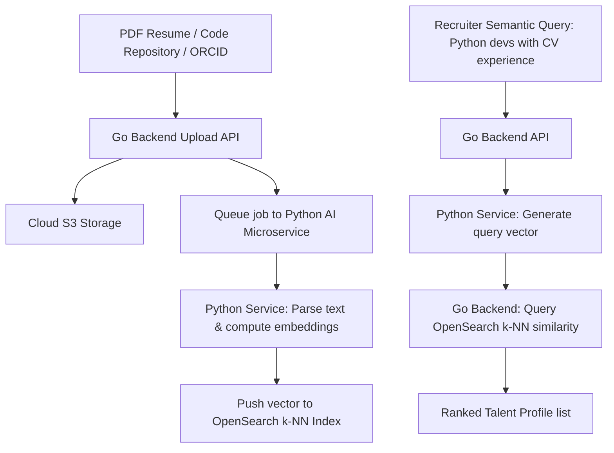

# Phase 10: AI Roadmap & Vector Search Architecture

This document designs the AI capabilities, model selections, RAG pipelines, and vector search strategies inside our independent Python microservice and OpenSearch cluster.

---

## 🤖 AI Models & Allocation

We split our AI tasks across models to optimize response times and lower API costs:

* **Conversational Assistant**: **Gemini 1.5 Flash** (Google). Chosen for its fast response times, low token cost, and 1M+ token context window, allowing us to load full course syllabus modules or research papers into the system prompt.
* **Resume & Document Ingestion**: **Gemini 1.5 Pro** (Google). Provides high reasoning capabilities to parse unstructured PDF resumes and preprints, extracting structured JSON formats.
* **Code Audits & Technical Vetting**: **Claude 3.5 Sonnet** (Anthropic). Integrates with developer portfolios to audit repositories and conduct mock coding interviews.
* **Embeddings**: **Text-Embedding-004** (Google). Used to embed resumes, preprints, and user queries into 768-dimension vectors for semantic search.

---

## 🗺️ RAG & OpenSearch Vector Architecture

Semantic candidate matching and career guidance queries utilize a Retrieval-Augmented Generation (RAG) loop. Vector calculations and queries are offloaded to **OpenSearch's k-NN (k-nearest neighbors) plugin**.



### 1. OpenSearch k-NN Index Setup:
OpenSearch indexes vectors using HNSW (Hierarchical Navigable Small World) algorithms for high-speed semantic matching:

```json
PUT /profiles_vector_index
{
  "settings": {
    "index.knn": true
  },
  "mappings": {
    "properties": {
      "user_id": { "type": "keyword" },
      "role": { "type": "keyword" },
      "skills": { "type": "keyword" },
      "profile_vector": {
        "type": "knn_vector",
        "dimension": 768,
        "method": {
          "name": "hnsw",
          "space_type": "cosinesimil",
          "engine": "nmslib",
          "parameters": {
            "ef_construction": 512,
            "m": 16
          }
        }
      }
    }
  }
}
```

### 2. Execution Flow:
1. **Ingestion**: When a student updates their profile or completes a course, the Go backend pushes the metadata and raw text payload to the Python AI service. The Python service extracts text, computes a 768-dimension vector embedding, and saves it into OpenSearch.
2. **Matching Query**: A recruiter enters a semantic search query. The Go backend forwards the query to the Python AI service, which generates a query vector. The Go backend then executes a k-NN search query against OpenSearch, applying filters (e.g. limit to a specific university):
   ```json
   POST /profiles_vector_index/_search
   {
     "size": 10,
     "query": {
       "knn": {
         "profile_vector": {
           "vector": [0.15, -0.04, 0.89, "..."],
           "k": 10
         }
       }
     }
   }
   ```

---

## 🔒 Privacy & Cost Optimizations

### 1. PII Redaction
* Before sending raw resume text to LLM embedding APIs, the Python service anonymizes the payload, stripping out candidate phone numbers, home addresses, and emails. Names are replaced with temporary tokens (e.g., `[CANDIDATE_402]`), which are re-mapped only on our secure PostgreSQL database.

### 2. Token Caching
* **Gemini Context Caching**: We cache static system instructions, course catalogs, and standard research indices on Gemini's API servers. This reduces input token billing by up to **80%** when students ask multiple questions on the same course syllabus.
