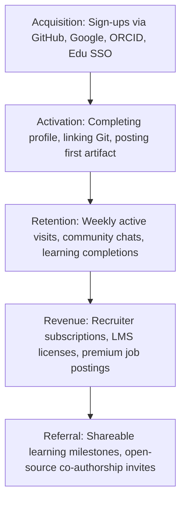

# Phase 1: Product Vision & Core Mission

## 🎯 Mission Statement
To build the unified digital infrastructure that connects learning, research, software creation, startup incubation, and career development into a single, cohesive, AI-augmented ecosystem. Acadyk is the operating system for professional and academic life.

## 👁️ Vision Statement
To eliminate the friction and fragmentation of professional growth. We envision a world where a student's project commit on GitHub, their research paper on arXiv, their certification from Coursera, and their collaboration in a startup community are automatically synced, contextually understood by AI, and instantly verifiable by global recruiters and partners.

---

## 🔑 Core Product Principles

1. **Interconnected Integrity**: Avoid data silos. Every action in one module (e.g., passing a course, pushing code, publishing a paper) enriches the user's unified profile.
2. **Proof-of-Capability**: Shift from self-reported summaries (LinkedIn model) to verifiable outputs (GitHub/ResearchGate model). We prioritize real artifacts: repositories, papers, course completions, and peer endorsements.
3. **AI as an Active Catalyst**: AI is not just a chatbot; it is a personalized agent that identifies skill gaps, drafts collaborations, matches mentors, recommends research co-authors, and sources recruiters based on code and research output.
4. **Community-Centric Growth**: Professional growth happens in clusters. We facilitate micro-communities (Incubators, Research Labs, Study Groups) with native workspace tools.
5. **Privacy and IP Sovereignty**: Researchers own their IP; developers own their code permissions. We enforce strict data access controls, especially regarding AI training.

---

## 👥 Target Audience & Persona Segments

```
                          ┌──────────────────────────┐
                          │     Acadyk Ecosystem     │
                          └─────────────┬────────────┘
         ┌──────────────────┬───────────┴───────────┬──────────────────┐
  ┌──────▼──────┐    ┌──────▼──────┐         ┌──────▼──────┐    ┌──────▼──────┐
  │   Learners  │    │  Creators   │         │ Researchers │    │ Enterprise  │
  │  & Students │    │& Developers │         │ & Academics │    │ & Recruiters│
  └─────────────┘    └─────────────┘         └─────────────┘    └─────────────┘
```

### 1. The Learner (Students & Career Changers)
* **Goal**: Acquire market-relevant skills, obtain mentorship, build a portfolio, and secure jobs.
* **Pain Point**: Fragmented credentials, lack of real project experience, high cost of education platforms, and "cold start" job searches.

### 2. The Creator (Developers & Designers)
* **Goal**: Collaborate on open-source, launch projects, join early-stage startups, and showcase code.
* **Pain Point**: Traditional resumes don't represent coding skill; GitHub code is decoupled from professional profiles; recruitment processes are generic and non-technical.

### 3. The Researcher (Academics & Scientists)
* **Goal**: Share preprints, peer-review papers, collaborate across institutions, secure grants, and commercialize research.
* **Pain Point**: Paywalled journals (ResearchGate/Elsevier), lack of cross-disciplinary collaboration, and difficulty connecting research to industrial application.

### 4. The Institution (Universities & Incubators)
* **Goal**: Manage alumni, track placement success, host incubators, share course curricula, and coordinate inter-departmental research.
* **Pain Point**: Outdated CRM systems, fragmented alumni communication, and manual placement tracking.

### 5. The Recruiter (Corporate HR & Tech Leaders)
* **Goal**: Source verified talent, decrease time-to-hire, and assess real-world capabilities.
* **Pain Point**: Keyword-stuffed resumes, fake certificates, high cost of LinkedIn Recruiter, and poor signal-to-noise ratio in applications.

---

## 💡 Value Propositions

* **For Users**: A lifetime digital ledger of your intellect. Your profile updates dynamically as you write code, write papers, and learn new skills. The profile *validates itself*.
* **For Institutions**: A plug-and-play white-label dashboard to manage students, host incubators, run alumni programs, and interface directly with recruiters.
* **For Enterprises**: Direct pipeline to verified talent. Filter candidates not by where they went to school, but by the actual code they wrote, tests they passed, and research papers they peer-reviewed.

---

## 📊 Competitive Analysis

| Dimension | LinkedIn | ResearchGate | GitHub | Coursera | Discord | **Acadyk** |
| :--- | :--- | :--- | :--- | :--- | :--- | :--- |
| **Primary Domain** | Professional Networking | Academic Sharing | Code Versioning & Collaboration | Online Certifications | Community Chat | **Unified Career & Learning Ecosystem** |
| **Verification Level** | Low (Self-reported text) | Medium (Institutional email checks) | High (Actual code commits) | Medium (Paid certs, ID verification) | Low (Self-reported / Roles) | **Ultra-High (Interlinked repos, verified certs, peer reviews, institutional SSO)** |
| **AI Capabilities** | Low (Generic post drafting) | None | Medium (Copilot code assistant) | Low (Course helpers) | Low (Moderator bots) | **Deep (RAG-driven career coaching, automated team formation, CV analysis, semantic search)** |
| **Academic & R&D** | Extremely poor | High (but siloed from business/startups) | Low | Medium | Low | **High (Native Preprint indexer, citation tracker, tech-transfer portal)** |
| **Incubator / Startup Tools**| Low (Groups only) | None | Medium (Orgs) | None | Low | **High (Cap table templates, equity structures, demo-day host, investor portals)** |
| **Monetization Cost** | High ($150+/mo for recruiters; premium for users) | Ads / Premium placements | Free (OSS) / Paid (Teams) | Subscription per course / certificate | Free / Nitro boosts | **Freemium network + SaaS fees for Universities/Recruiters + micro-transactions for courses** |

---

## 📈 Success Metrics (The AARRR Framework)

We measure platform traction through an AI-influenced Pirate Metrics funnel:



### 1. Acquisition Metrics
* **Monthly Active Sign-ups (MAS)**: Partitioned by segment (Learner, Creator, Researcher, Institution).
* **CAC (Customer Acquisition Cost)**: Broken down by organic loops (GitHub integration) and paid marketing.

### 2. Activation Metrics
* **Activation Rate**: Profile completeness >80% (requires linking at least one external portfolio source like GitHub, ORCID, or passing one skills test) within 7 days.
* **First-Interaction Time**: Time taken for a new user to join a community, complete a lesson, or post a project.

### 3. Retention Metrics
* **DAU/MAU Ratio**: Aiming for >35% for creators and learners.
* **Churn Rate**: Percentage of users who do not return within 30 days.

### 4. Revenue Metrics
* **LTV (Lifetime Value)** of Recruiter and Institutional subscriptions.
* **ARPPU (Average Revenue Per Paying User)** on LMS course purchases and job postings.

### 5. Referral Metrics
* **Virality Coefficient (K-Factor)**: Tracked through shareable profile badges, workspace invitations, and peer review requests.
* **GitHub Repository Badging**: Number of GitHub repos linking back to Acadyk profiles.
