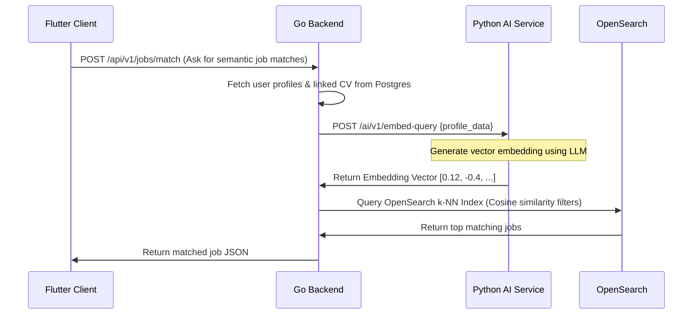

# Phase 3: System Architecture

This document describes the high-level system design, boundary specifications, database distribution, and communication patterns of the Acadyk platform.

---

## 🏗️ Architecture Design: Go Monolith + Python AI Microservice

Acadyk is built using a **Modular Go Monolith** for core operations, paired with a specialized **Python AI Microservice** to handle GPU/CPU-heavy neural tasks. Both query a shared infrastructure layer composed of PostgreSQL, Redis, and OpenSearch.

```
                                  ┌───────────────────────────┐
                                  │      Flutter Client       │
                                  │       (Mobile App)        │
                                  └─────────────┬─────────────┘
                                                │ HTTPS / WebSockets
                                                ▼
                                  ┌───────────────────────────┐
                                  │     Nginx API Gateway     │
                                  └─────────────┬─────────────┘
                                                │
       ┌────────────────────────────────────────┼────────────────────────────────────────┐
       │ Core Backend Monolith (Go / Golang)    │ Domain Modules                         │
       │                                        ▼                                        │
       │ ┌──────────────┐  ┌──────────────┐  ┌──────────────┐  ┌──────────────┐  ┌─────────────┐ │
       │ │ Auth Domain  │  │ Feed Domain  │  │ Jobs Domain  │  │ Inst Domain  │  │ Msg Domain  │ │
       │ └──────┬───────┘  └──────┬───────┘  └──────┬───────┘  └──────┬───────┘  └──────┬──────┘ │
       │        │                 │                 │                 │                 │      │
       │        └─────────────────┼─────────────────┼─────────────────┼─────────────────┘      │
       │                          │ Domain Event Broker (Redis PubSub)                     │
       └──────────────────────────┼─────────────────┬──────────────────────────────────────┘
                                  │                 │
                                  │                 │ Secure JSON / gRPC
                                  │                 ▼
                                  │     ┌───────────────────────────┐
                                  │     │    Python AI Service      │
                                  │     │    (FastAPI / RAG)        │
                                  │     └───────────┬───────────────┘
                                  │                 │
            ┌─────────────────────┴───────┐   ┌─────▼───────────────────────┐
            │       Primary Database      │   │        Unified Search       │
            │  PostgreSQL (Multi-Tenant)  │   │  OpenSearch (Lexical/Vector)│
            └──────────────┬──────────────┘   └─────────────┬───────────────┘
                           │                                │
            ┌──────────────▼──────────────┐   ┌─────────────▼───────────────┐
            │        Cache Layer          │   │         Blob Storage        │
            │     Redis (Read Cache)      │   │  S3-Compatible Object Store │
            └─────────────────────────────┘   └─────────────────────────────┘
```

### Rationale & Trade-offs
* **Why Go for the Monolith?**: Go offers native concurrency (goroutines), single-binary deployments, minimal memory consumption, and execution speeds that match C/C++ metrics. This guarantees our API response times remain low even during sudden traffic spikes.
* **Why Python for AI?**: Python is the language of machine learning. Hosting AI features (embeddings, LLM orchestrations, RAG pipelines) inside an independent Python FastAPI microservice keeps ML dependency trees (e.g. PyTorch, LangChain, Pydantic) isolated, preventing dependency bloat in the core Go compiler.
* **Why OpenSearch for Both?**: Rather than deploying both Elasticsearch and Qdrant, we use **OpenSearch**. OpenSearch supports advanced full-text search (BM25 lexical) and features a high-performance **k-NN (k-nearest neighbors) plugin** to execute cosine-similarity queries on AI vectors, reducing infrastructure overhead.

---

## 📡 Communication Patterns & Messaging

### 1. External APIs (REST HTTP & WebSockets)
* **REST APIs**: Handled by the Go monolith (`http.Handler` or a router like Gin/chi) for standard actions.
* **WebSockets**: The Go backend utilizes libraries like `gorilla/websocket` to handle persistent client connections, broadcasting DMs, notifications, and real-time updates.

### 2. Secure Inter-Service API (Go <-> Python AI)
* The Go backend processes incoming client queries, collects required user metadata from PostgreSQL, and forwards requests to the Python AI service using secure HTTPS REST endpoints (with authentication headers) or internal **gRPC** calls for latency-critical items.



---

## 🗄️ Cache, Search & Object Storage

* **PostgreSQL**: Contains relational data. All table joins are scoped inside domain boundaries.
* **Redis**: Acts as the session cache, OAuth state manager, and rate limiter. Go uses goroutine pooling to pipe events to Redis queues.
* **OpenSearch**: Dynamically synced with PostgreSQL database tables using CDC (Change Data Capture) systems or transaction hooks in Go repository layers.
* **S3-Compatible Storage**: Cloudflare R2, AWS S3, or MinIO. The Go backend issues signed upload URLs to mobile/web clients, allowing direct media uploading without routing large files through the application memory space.
