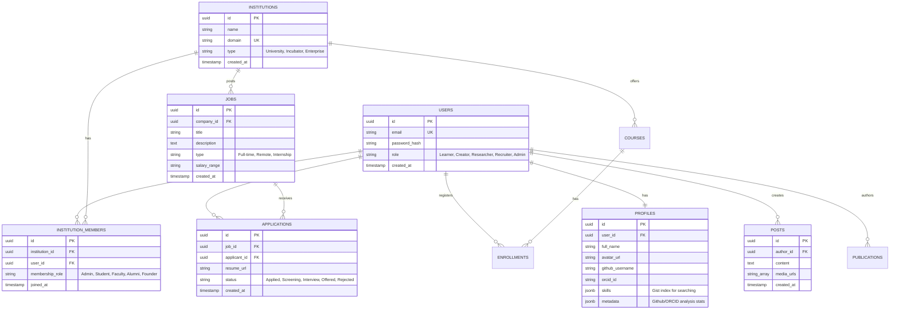

# Phase 5: Database Planning & Relational Design

This blueprint designs the PostgreSQL relational schema, entity relationships, database index optimizations, multi-tenancy context passing in Go, and backup procedures.

---

## 📊 Entity Relationship Diagram (ERD)



---

## 💾 SQL Schema & Go Struct Mappings

We map PostgreSQL schemas to Go structs using database tags (`db` or `gorm` compatible) for safe validation and query mappings:

```go
package models

import (
	"time"
	"github.com/google/uuid"
)

type User struct {
	ID           uuid.UUID `gorm:"type:uuid;primary_key;default:gen_random_uuid()" json:"id"`
	Email        string    `gorm:"type:varchar(255);uniqueIndex;not null" json:"email"`
	PasswordHash string    `gorm:"type:varchar(255);not null" json:"-"`
	Role         string    `gorm:"type:varchar(50);not null" json:"role"` // Learner, Creator, Researcher, Recruiter, Admin
	CreatedAt    time.Time `gorm:"autoCreateTime" json:"created_at"`
	UpdatedAt    time.Time `gorm:"autoUpdateTime" json:"updated_at"`
}

type Profile struct {
	ID             uuid.UUID `gorm:"type:uuid;primary_key;default:gen_random_uuid()" json:"id"`
	UserID         uuid.UUID `gorm:"type:uuid;not null;index" json:"user_id"`
	FullName       string    `gorm:"type:varchar(255);not null" json:"full_name"`
	AvatarURL      string    `gorm:"type:varchar(512)" json:"avatar_url"`
	GitHubUsername string    `gorm:"type:varchar(100)" json:"github_username"`
	OrcidID        string    `gorm:"type:varchar(50)" json:"orcid_id"`
	Skills         []string  `gorm:"type:jsonb" json:"skills"` // GIN indexed skill tags
	Metadata       string    `gorm:"type:jsonb" json:"metadata"` // Sync metrics
}
```

---

## 🛡️ Multi-Tenancy Strategy (Go DB Context Setup)

Acadyk uses **PostgreSQL Row-Level Security (RLS)** to partition university and incubator database rows within a shared database schema.

### Go RLS Context Implementation:
To execute a database transaction with RLS, our Go backend middleware extracts the user's `tenant_id` from the request context and sets the session config variable before running subsequent database queries:

```go
package middleware

import (
	"context"
	"database/sql"
	"net/http"
)

func TenantRLSMiddleware(db *sql.DB) func(http.Handler) http.Handler {
	return func(next http.Handler) http.Handler {
		return http.HandlerFunc(func(w http.ResponseWriter, r *http.Request) {
			tenantID := r.Header.Get("X-Tenant-ID") // E.g., MIT UUID
			if tenantID == "" {
				next.ServeHTTP(w, r)
				return
			}

			// Run in a single transaction to set configuration parameter locally
			ctx := context.WithValue(r.Context(), "tenant_id", tenantID)
			r = r.WithContext(ctx)

			next.ServeHTTP(w, r)
		})
	}
}
```

Every database query executed inside our service transaction block begins by preparing the local tenant session parameter:

```sql
SET LOCAL app.current_tenant_id = 'tenant-uuid-here';
```

Postgres compares this local session parameter against our security policy definitions:

```sql
CREATE POLICY tenant_isolation_policy ON courses 
USING (tenant_id = NULLOR(current_setting('app.current_tenant_id', true)::uuid));
```

---

## ⚡ Indexing & Optimization Strategy

1. **Foreign Key Indexes**:
   Standard index targets to accelerate database join processes:
   ```sql
   CREATE INDEX idx_profiles_user_id ON profiles(user_id);
   CREATE INDEX idx_enrollments_student_id ON enrollments(student_id);
   ```
2. **GIN Indexes for JSONB Arrays**:
   Accelerates queries that match users based on skill sets:
   ```sql
   CREATE INDEX idx_profiles_skills ON profiles USING gin(skills);
   ```
3. **Compound Status Index**:
   Speeds up query execution on job application dashboards:
   ```sql
   CREATE INDEX idx_applications_job_status ON applications(job_id, status);
   ```
